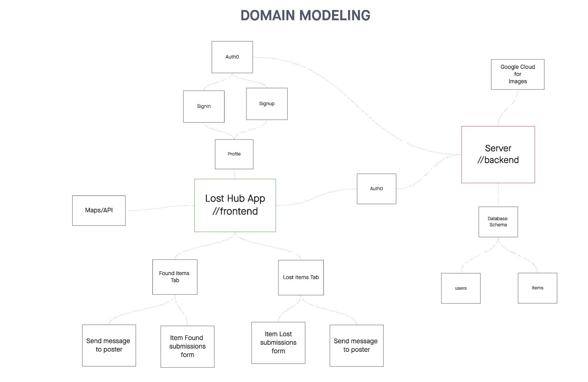

# LostHub Server

**Authors**:

- [Adnan Mohamud](https://github.com/adnanm123)
- [Chester Lee Coloma](https://github.com/cleecoloma)
- [David Danilchik](https://github.com/Arkuris)
- [Ekaterina Khoroshilova](https://github.com/KatKho)

## Overview

The Lost Hub Backend is an essential component of the LostHub application, designed to efficiently manage the reporting and tracking of lost and found items. With an aim to streamline the process of reconnecting people with their lost belongings, LostHub offers a user-friendly and comprehensive platform for users to report lost items, discover found items, and communicate with finders. This project is not just a technical solution but also a community service initiative to reduce the stress and impact of losing personal items.

## Getting Started

To get the LostHub server up and running on your machine, follow these instructions:

1. **Clone the Repository**: `git clone https://github.com/your-username/losthub-server.git`
2. **Navigate to the Project Directory**: `cd lost-hub-backend`
3. **Install Dependencies**: Run `npm install` to install the required dependencies.
4. **Set Up MongoDB Database**:
   - Create a MongoDB database.
   - Acquire the connection URI.
5. **Configure Environment Variables**:
   - Rename the `.env.sample` file to `.env`.
   - Update MONGO_DB in the `.env` file with mongoDB URI.
   - Update GCS_BUCKET in the `.env` file with Google Cloud Storage Bucket.
   - Update PORT in the `.env` file with a PORT number or `3001`.
   - Update JKWS_URI in the `.env` file with JSON Web Key Set from Auth0.
6. **Launch the Express Server**: Run `npm start` or `npm run dev`.
7. **Access the Application**: Open your web browser and go to the provided URL (typically `http://localhost:3001`).

## Domain Modeling

## Architecture

LostHub is structured using the MERN stack:

- **Back-end**: Managed by an Express server, which handles HTTP requests and communicates with the MongoDB database and Google Cloud.
- **Database**: Utilizes MongoDB to keep track of items, including descriptions, locations, image URLs, and types (lost or found).

## License

LostHub is licensed under the [MIT License](./LICENSE). Feel free to use, modify, and distribute the code as per the terms of the license.

## Support

For any issues or questions, please [open a new issue](https://github.com/lost-hub-app/lost-hub-backend/issues) on GitHub. We appreciate your feedback!

## Acknowledgments

Special thanks to:

- Jacob Knaack
- ChatGPT
- Bard
- Slidesgo
